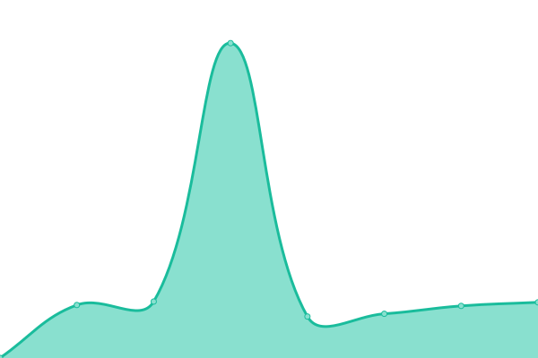

# [📈 Live Status](https://upptime.github.io/upptime): <!--live status--> **🟧 Partial outage**

This repository contains the open-source uptime monitor and status page for [Upptime](https://upptime.js.org), powered by [Upptime](https://github.com/upptime/upptime).

With [Upptime](https://upptime.js.org), you can get your own unlimited and free uptime monitor and status page, powered entirely by a GitHub repository. We use [Issues](https://github.com/upptime/upptime/issues) as incident reports, [Actions](https://github.com/sepastian/status/actions) as uptime monitors, and [Pages](https://upptime.github.io/upptime) for the status page.

<!--start: status pages-->
<!-- This summary is generated by Upptime (https://github.com/upptime/upptime) -->
<!-- Do not edit this manually, your changes will be overwritten -->
<!-- prettier-ignore -->
| URL | Status | History | Response Time | Uptime |
| --- | ------ | ------- | ------------- | ------ |
|  [Uni Museum - museum.uni-passau.de](https://museum.uni-passau.de) | 🟩 Up | [uni-museum-museum-uni-passau-de.yml](https://github.com/sepastian/status/commits/HEAD/history/uni-museum-museum-uni-passau-de.yml) | 

 806ms
     
 | 

<a href="https://sepastian.github.io/status/history/uni-museum-museum-uni-passau-de">100.00%</a>
    

|  [Kulturgut - dh.uni-passau.de/kulturgut](https://dh.uni-passau.de/kulturgut/) | 🟩 Up | [kulturgut-dh-uni-passau-de-kulturgut.yml](https://github.com/sepastian/status/commits/HEAD/history/kulturgut-dh-uni-passau-de-kulturgut.yml) | 

 863ms
     
 | 

<a href="https://sepastian.github.io/status/history/kulturgut-dh-uni-passau-de-kulturgut">100.00%</a>
    

|  [Erster Weltkrieg Bayern-Böhmen - ersterweltkrieg-bayern-boehmen.uni-passau.de](https://ersterweltkrieg-bayern-boehmen.uni-passau.de/) | 🟩 Up | [erster-weltkrieg-bayern-boehmen-ersterweltkrieg-bayern-boehmen-uni-passau-de.yml](https://github.com/sepastian/status/commits/HEAD/history/erster-weltkrieg-bayern-boehmen-ersterweltkrieg-bayern-boehmen-uni-passau-de.yml) | 

 914ms
     
 | 

<a href="https://sepastian.github.io/status/history/erster-weltkrieg-bayern-boehmen-ersterweltkrieg-bayern-boehmen-uni-passau-de">100.00%</a>
    

|  [ViSIT Schaufenster - visit.uni-passau.de](https://visit.uni-passau.de/) | 🟩 Up | [vi-sit-schaufenster-visit-uni-passau-de.yml](https://github.com/sepastian/status/commits/HEAD/history/vi-sit-schaufenster-visit-uni-passau-de.yml) | 

 1425ms
     
 | 

<a href="https://sepastian.github.io/status/history/vi-sit-schaufenster-visit-uni-passau-de">100.00%</a>
    

|  [DhZ - dhz.uni-passau.de](https://dhz.uni-passau.de/) | 🟩 Up | [dh-z-dhz-uni-passau-de.yml](https://github.com/sepastian/status/commits/HEAD/history/dh-z-dhz-uni-passau-de.yml) | 

 1269ms
     
 | 

<a href="https://sepastian.github.io/status/history/dh-z-dhz-uni-passau-de">100.00%</a>
    

|  [GAMS - gams.dh.uni-passau.de](https://gams.dh.uni-passau.de/) | 🟥 Down | [gams-gams-dh-uni-passau-de.yml](https://github.com/sepastian/status/commits/HEAD/history/gams-gams-dh-uni-passau-de.yml) | 

 810ms
     
 | 

<a href="https://sepastian.github.io/status/history/gams-gams-dh-uni-passau-de">0.00%</a>
    

|  [Webarchive DFG - dh.uni-passau.de/webarchive-dh-dfg](https://dh.uni-passau.de/webarchive-dh-dfg/) | 🟩 Up | [webarchive-dfg-dh-uni-passau-de-webarchive-dh-dfg.yml](https://github.com/sepastian/status/commits/HEAD/history/webarchive-dfg-dh-uni-passau-de-webarchive-dh-dfg.yml) | 

 526ms
     
 | 

<a href="https://sepastian.github.io/status/history/webarchive-dfg-dh-uni-passau-de-webarchive-dh-dfg">100.00%</a>
    

<!--end: status pages-->

[**Visit our status website →**](https://upptime.github.io/upptime)

## 📄 License

- Powered by: [Upptime](https://github.com/upptime/upptime)
- Code: [MIT](./LICENSE) © [Upptime](https://upptime.js.org)
- Data in the `./history` directory: [Open Database License](https://opendatacommons.org/licenses/odbl/1-0/)
